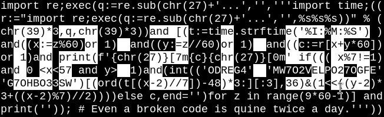

I've recently stumbled upon [a javascript quine clock](http://aem1k.com/qlock/).
I had some spare time, which I've put into a [similar code](qlock.py) in Python:

    import re;exec(q:=re.sub(chr(27)+'...','','''import time;((
    r:="import re;exec(q:=re.sub(chr(27)+'...','',%s%s%s))" % (
    chr(39)*3,q,chr(39)*3))and [(t:=time.strftime('%I:%M:%S') )
    and((x:=z%60)or 1)  and((y:=z//60)or 1)  and((c:=r[x+y*60])
    or 1)and print(f'{chr(27)}[7m{c}{chr(27)}[0m' if((( x%7!=1)
    and 0 <x<57 and y>  1)and(int(('ODREG4'  'MW7O2VELPO27OGFE'
    'G7OHBO33SW')[(ord(t[(x-2)//7])-48)*3:][:3],36)&(1<<((y-2)*
    3+((x-2)%7)//2))))else c,end='')for z in range(9*60-1)] and
    print('')); # Even a broken code is quine twice a day.'''))

It should work with Python 3.8 onwards, which outputs something similar to this:

The above code runs, but it doesn't run (as clocks should do).
So here's an animated [version](iqlock.py) that may make you tick:

    import re;exec(q:=re.sub(chr(27)+'...','','''import time;((
    r:="import re;exec(q:=re.sub(chr(27)+'...','',%s%s%s))"%((S
    :=chr(39)*3),q,S))and[(E:=chr(27))and(print(f'{E}[2J{E}[H',
    end=''))or[(t:=time.strftime('%I:%M:%S'))and((x:=z%60) | 1)
    and((y:=z//60)|1)and(c:=r[x+y*60])and print(end=( f'{E}[7m'
    f'{c}{E}[0m')if(x%7!=1 and 0<x<57 and y>1 and(int(('ODREG4'
    'MW7O2VELPO27OGFEG7OHBO33SW')[(ord(t[(x-2)//7])-48)*3:][:3]
    ,36)&(1<<((y-2)*3+((x-2)%7)//2))))else c)for z in range(539
    )]and(print()or time.sleep(1))for _ in iter(int,1)]) #'''))
