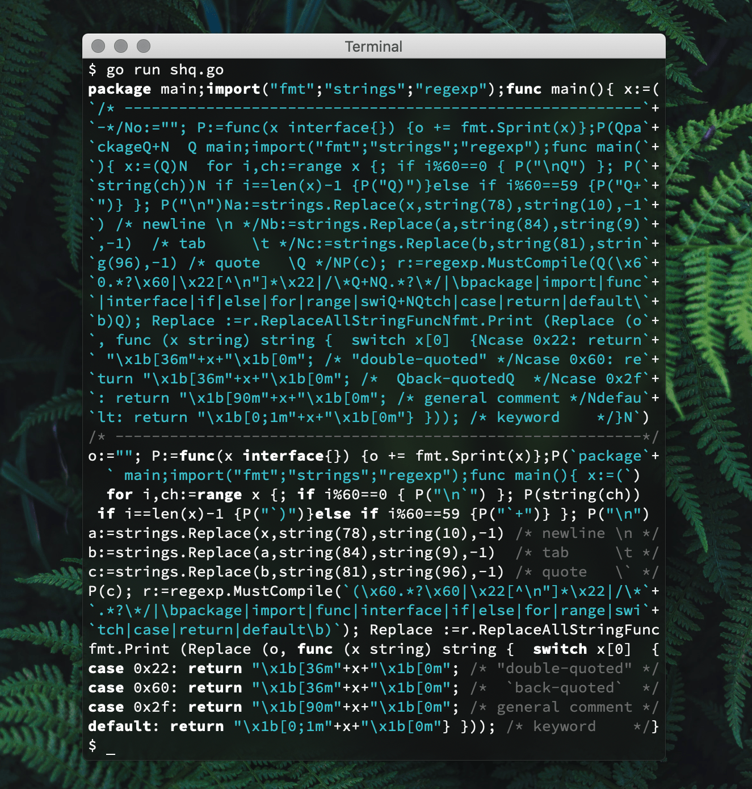

I wrote a code in Go. It's fixed-width, nicely commented and
when run, outputs it's own source code:

```
package main;import("fmt";"strings";"regexp");func main(){ x:=(
`/* ---------------------------------------------------------`+
`-*/No:=""; P:=func(x interface{}) {o += fmt.Sprint(x)};P(Qpa`+
`ckageQ+N  Q main;import("fmt";"strings";"regexp");func main(`+
`){ x:=(Q)N  for i,ch:=range x {; if i%60==0 { P("\nQ") }; P(`+
`string(ch))N if i==len(x)-1 {P("Q)")}else if i%60==59 {P("Q+`+
`")} }; P("\n")Na:=strings.Replace(x,string(78),string(10),-1`+
`) /* newline \n */Nb:=strings.Replace(a,string(84),string(9)`+
`,-1)  /* tab     \t */Nc:=strings.Replace(b,string(81),strin`+
`g(96),-1) /* quote   \Q */NP(c); r:=regexp.MustCompile(Q(\x6`+
`0.*?\x60|\x22[^\n"]*\x22|/\*Q+NQ.*?\*/|\bpackage|import|func`+
`|interface|if|else|for|range|swiQ+NQtch|case|return|default\`+
`b)Q); Replace :=r.ReplaceAllStringFuncNfmt.Print (Replace (o`+
`, func (x string) string {  switch x[0]  {Ncase 0x22: return`+
` "\x1b[36m"+x+"\x1b[0m"; /* "double-quoted" */Ncase 0x60: re`+
`turn "\x1b[36m"+x+"\x1b[0m"; /*  Qback-quotedQ  */Ncase 0x2f`+
`: return "\x1b[90m"+x+"\x1b[0m"; /* general comment */Ndefau`+
`lt: return "\x1b[0;1m"+x+"\x1b[0m"} })); /* keyword    */}N`)
/* ----------------------------------------------------------*/
o:=""; P:=func(x interface{}) {o += fmt.Sprint(x)};P(`package`+
  ` main;import("fmt";"strings";"regexp");func main(){ x:=(`)
  for i,ch:=range x {; if i%60==0 { P("\n`") }; P(string(ch))
 if i==len(x)-1 {P("`)")}else if i%60==59 {P("`+")} }; P("\n")
a:=strings.Replace(x,string(78),string(10),-1) /* newline \n */
b:=strings.Replace(a,string(84),string(9),-1)  /* tab     \t */
c:=strings.Replace(b,string(81),string(96),-1) /* quote   \` */
P(c); r:=regexp.MustCompile(`(\x60.*?\x60|\x22[^\n"]*\x22|/\*`+
`.*?\*/|\bpackage|import|func|interface|if|else|for|range|swi`+
`tch|case|return|default\b)`); Replace :=r.ReplaceAllStringFunc
fmt.Print (Replace (o, func (x string) string {  switch x[0]  {
case 0x22: return "\x1b[36m"+x+"\x1b[0m"; /* "double-quoted" */
case 0x60: return "\x1b[36m"+x+"\x1b[0m"; /*  `back-quoted`  */
case 0x2f: return "\x1b[90m"+x+"\x1b[0m"; /* general comment */
default: return "\x1b[0;1m"+x+"\x1b[0m"} })); /* keyword    */}
```

Right, forgot to mention - the output is syntax highlighted.
Here's how it actually looks like:



## how

It's quite simple. First you write a quine.
Then you add syntax highlighting feature to it.

OK, a bit more verbose explanation:

1. Write a quine of the form:

    ```
    p1: initial boilerplate: package name, imports etc.
    p2: declare a variable `x` that contains the code after itself
    p3: print statement that outputs the initial boilerplate
    p4: code that outputs `x`'s value representation
    p5: print statement that outputs the value of `x`
    ```

    The tricky part is updating the value of `x` in `p2`.
    Luckily, it can be automated by an external script
    that reads the code starting from `p3` (`/* ---` in my case) and outputs
    the necessary value. The script's output is copy-pasted
    back into the quine once `p3, p4 & p5` is polished.

    I also encode certain characters that require character escaping,
    which will be decoded before `p5`.
    This way I don't have to deal with them in `p4`.

2. Update the quine to store it's own value in a certain variable.

   In the code above, it's `o`. This way the quine becomes "self-aware",
   knowing what it's source will look like prior to printing.

3. Add ANSI escape sequences between certain terms.

    I like to keep things simple, so my colorscheme only highlights
    keywords with <b>bold</b>,
    strings with <span style="color: teal">cyan</span>
    and comments with <span style="color: #aaa">low-contrast colour</span>.

    For that, I used a hand-crafted regexp that matches certain code parts.
    Here's the breakdown:

    ```
    \x60.*?\x60                        <- `back-quoted strings`
    \x22[^\n"]*\x22                    <- "double-quoted string"
    /\*.*?\*/                          <- /* general comments */
    \bpackage|import|func|and|etc\b    <- reserved keywords
    ```

    The matches are then wrapped in ANSI codes:

    ```
    "\x1b[36m"  + x + "\x1b[0m" // cyan
    "\x1b[90m"  + x + "\x1b[0m" // dark grey
    "\x1b[0;1m" + x + "\x1b[0m" // bold
    ```
