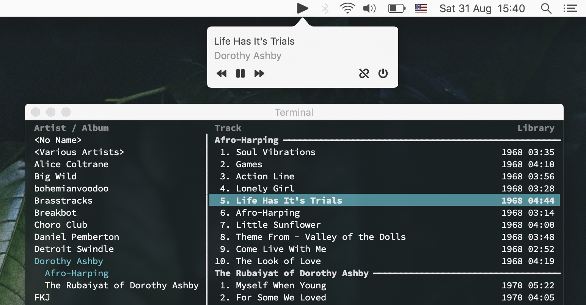

_cmusie_ is a small utility app to control [cmus] playback on MacOS.

The app captures audio playback button inputs on MacOS and reroutes them to _cmus_.
It comes with a small tray icon that can show currently playing song,
along with button controls.

The project is written in Objective-C,
with the low-level media keys control code borrowed from [mpv].

Source code: https://github.com/nkanaev/cmusie

[cmus]: https://cmus.github.io/
[mpv]: https://github.com/mpv-player/mpv
